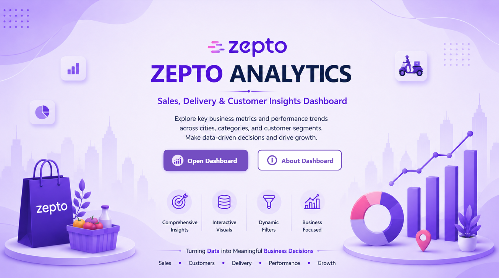
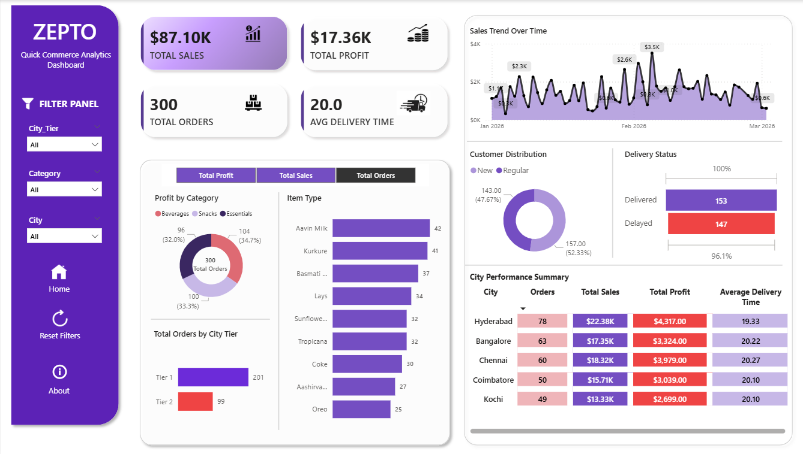
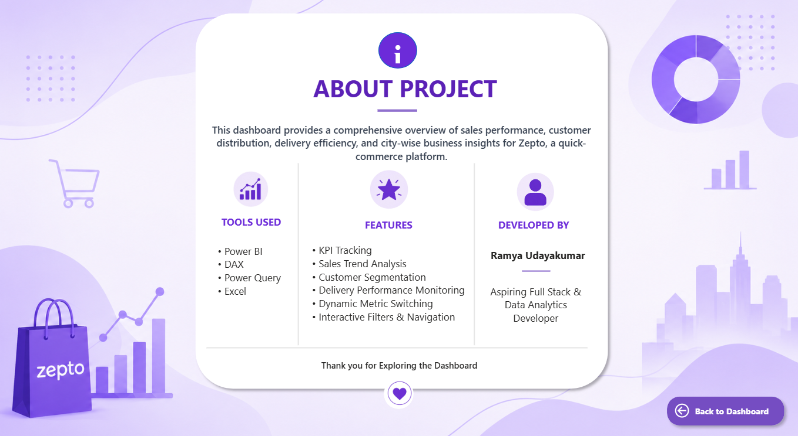

# 📊 Zepto Sales & Delivery Analytics Dashboard

An interactive Power BI dashboard developed to analyze sales performance, customer behavior, delivery efficiency, and city-wise business insights for a quick-commerce platform.

This dashboard enables users to monitor KPIs and gain meaningful insights through interactive visualizations and business analytics.

---

## 🚀 Project Overview

The dashboard provides a centralized view of business performance metrics and supports data-driven decision making through dynamic reports and visual analysis.

Key focus areas include:

- Sales performance tracking
- Delivery performance analysis
- Product insights
- Customer distribution
- City-wise business trends
- Interactive navigation and filtering

---

## ✨ Features

- KPI Cards for business metrics
- Sales Trend Analysis
- Customer Distribution Insights
- Delivery Status Tracking
- Product Performance Analysis
- City Performance Summary
- Interactive Filters and Slicers
- Dynamic Metric Selection
- Multi-page Dashboard Navigation
- About and Home Pages

---

## 🛠 Tools & Technologies Used

- Power BI
- DAX
- Power Query
- Microsoft Excel

---

## 📁 Dashboard Pages

### 🏠 Home Page

Landing page designed for navigation and dashboard access.

---

### 📈 Executive Overview

Main analytics dashboard displaying:

- Sales KPIs
- Profit metrics
- Delivery insights
- Customer analysis
- Product trends
- City performance

---

### ℹ️ About Page

Contains project details, tools used, features, and dashboard information.

---

## 📂 Dataset Information

The dataset includes:

- Order information
- City details
- Product categories
- Delivery status
- Sales data
- Profit metrics
- Customer segments

---

## 📌 Dashboard KPIs

The dashboard tracks:

- Total Sales
- Total Profit
- Total Orders
- Average Delivery Time
- Product Performance
- Delivery Success Analysis

---

## 🎯 Business Objective

To build an interactive analytics dashboard capable of monitoring operational performance and providing insights for business decision-making in a quick-commerce environment.

---

## 👩‍💻 Developed By

**Ramya Udayakumar**

Aspiring Full Stack Developer | Data Analytics Enthusiast

---

⭐ If you like this project, feel free to give it a star.
